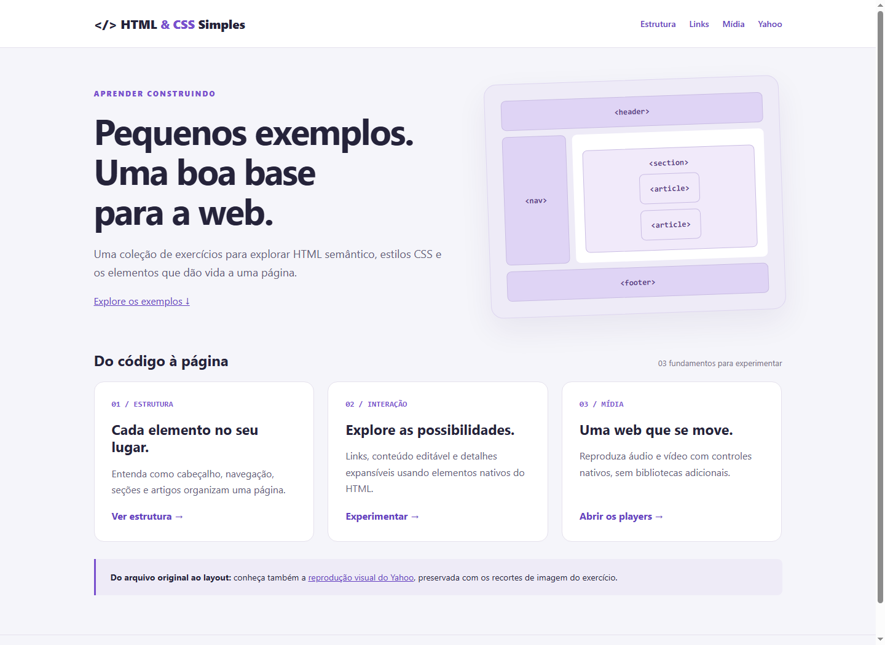
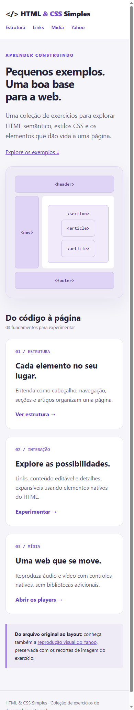
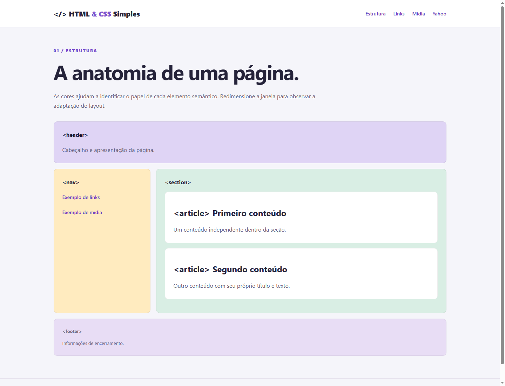
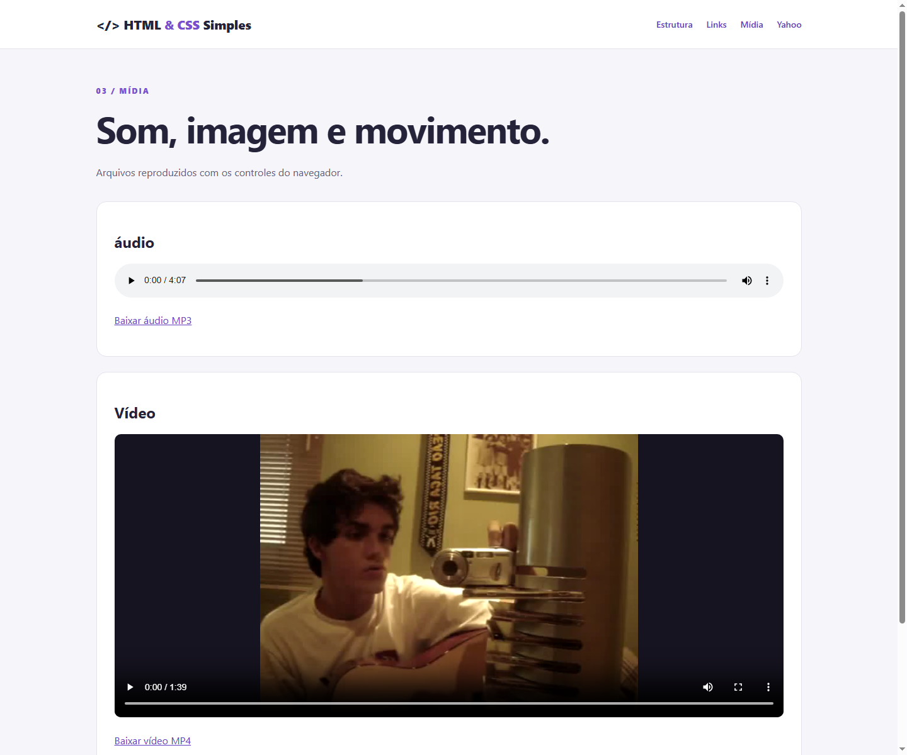

# HTML & CSS Simples

Coleção de exercícios de HTML e CSS com uma página inicial para explorar estrutura semântica, interação nativa, áudio, vídeo e uma reprodução visual do Yahoo.

## Capturas de tela

Capturas reais do projeto executado localmente no Chrome.

### Página inicial — desktop



### Página inicial — celular



### Estrutura semântica



### Áudio e vídeo



## Como executar

O projeto é estático: não exige instalação de dependências nem etapa de compilação. Abra `index.html` no navegador ou, com Python 3 instalado, execute na raiz:

```bash
python -m http.server 8000 --bind 127.0.0.1
```

Acesse [localhost:8000](http://localhost:8000). Para encerrar o servidor, pressione `Ctrl+C`.

## Exemplos

| Página | Conteúdo |
| --- | --- |
| [Início](index.html) | Apresentação e navegação pelos exercícios |
| [Estrutura](pages/estrutura.html) | `header`, `nav`, `section`, `article` e `footer` em um layout responsivo |
| [Links](pages/links.html) | Links externos, `details`, `summary`, `meter` e `contenteditable` |
| [Mídia](pages/midia.html) | Players nativos e downloads de áudio MP3 e vídeo MP4 |
| [Yahoo](pages/yahoo.html) | Composição visual usando as imagens do exercício original |

## Organização

```text
html_css_simples/
├── index.html                 # Página inicial
├── pages/                     # Exercícios HTML
│   ├── estrutura.html
│   ├── links.html
│   ├── midia.html
│   └── yahoo.html
├── assets/
│   ├── css/style.css          # Estilos compartilhados e responsividade
│   ├── images/yahoo/          # Recortes do portal original
│   └── media/                 # Now.mp3 e CatchSide.mp4
├── docs/
│   ├── aulas/                 # Apresentações do material original
│   └── screenshots/           # Capturas usadas neste README
├── .gitignore
└── README.md
```


## Observações e validação

As referências locais e as respostas HTTP das nove páginas foram verificadas. As capturas documentam a renderização da página inicial em desktop e celular, além dos exemplos de estrutura e mídia.

A página Yahoo preserva uma montagem de imagens: o texto e os controles dentro desses recortes não são interativos. Os arquivos de mídia originais não incluem legendas ou transcrições. A edição em `contenteditable` é temporária e não é salva ao recarregar.

